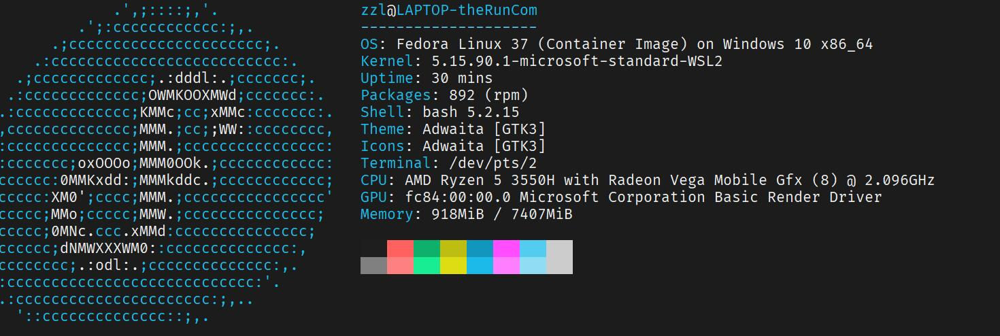
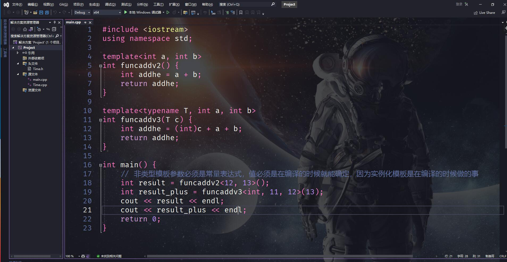
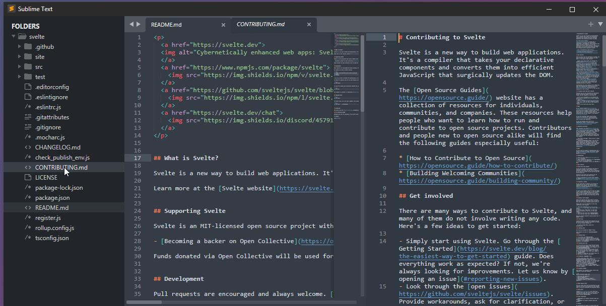
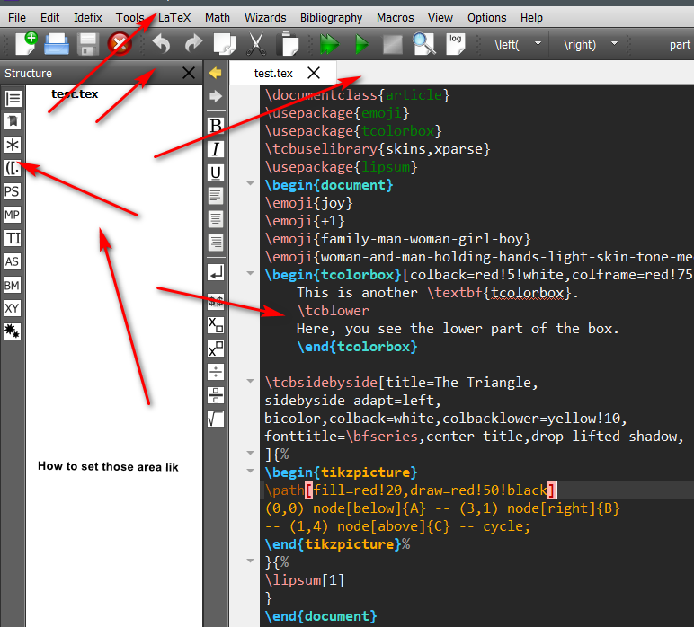
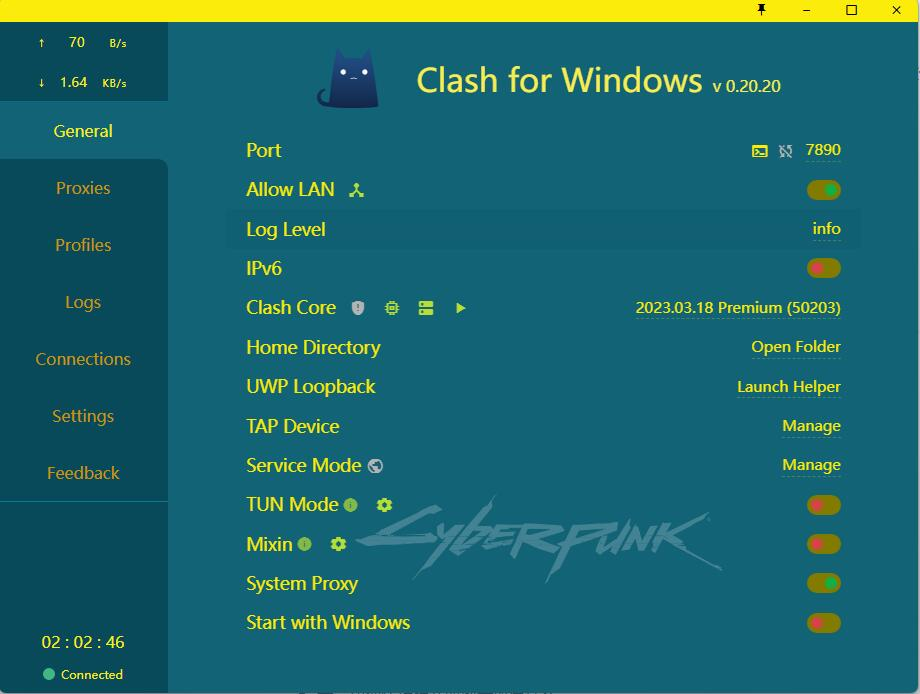
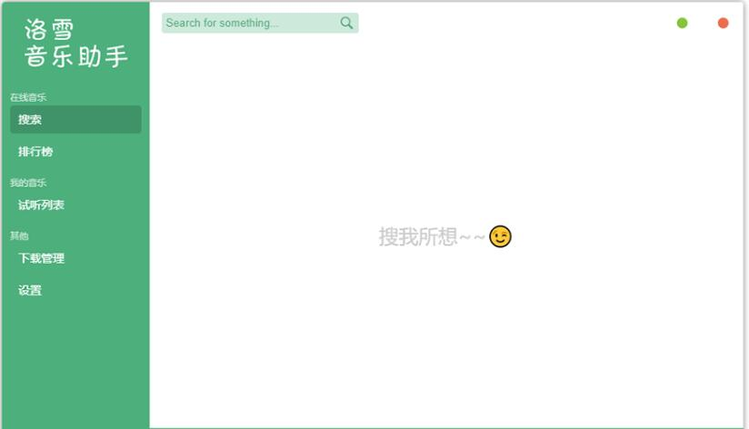
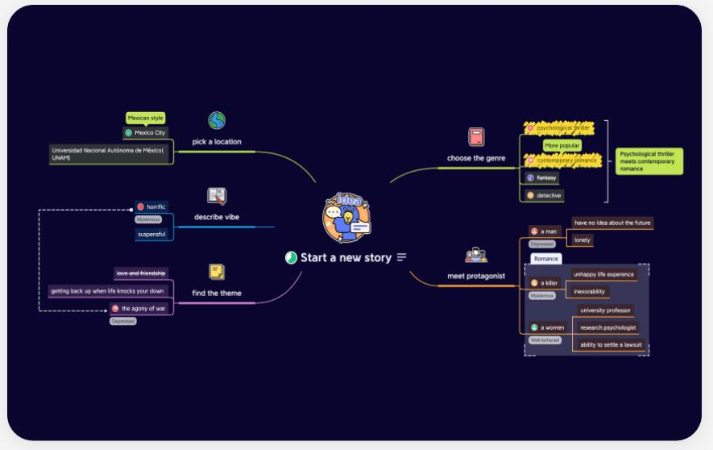
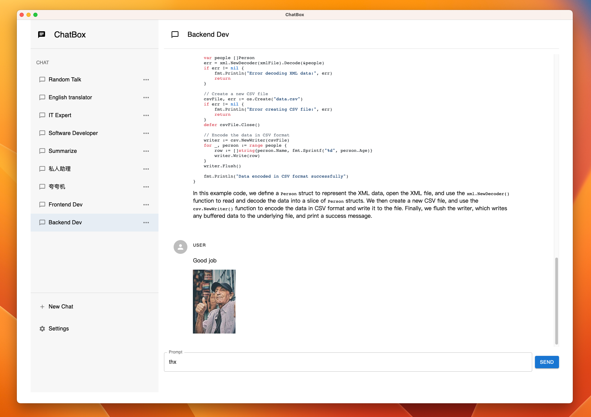
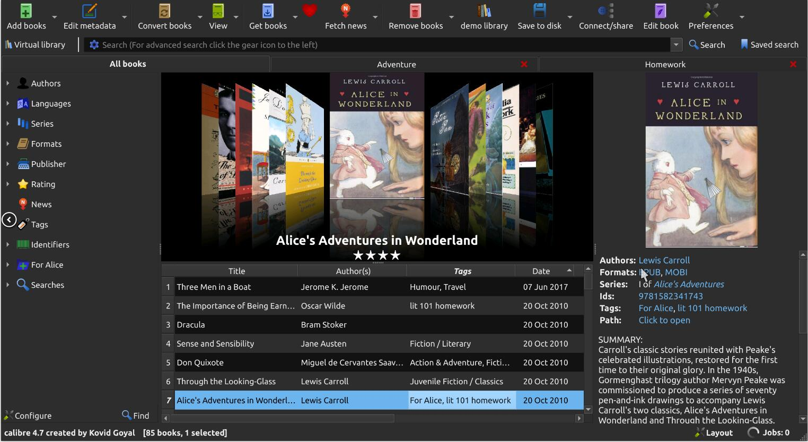

    

<h1 align="center">ToolSet</h1>

English | [简体中文](README_ZH.md)

🔧Toolset for personal use🔧

[📝Guide](https://github.com/theRunCom/ToolSet/wiki) |
[🔭Preview](#Preview) |
[☕Donation](#Donation)

## Preview

### **WSL2 Fedora37**

Fedora 37为开发人员提供了许多好处。它是一款可靠、用户友好且功能强大的操作系统，适用于笔记本电脑或台式电脑。它支持广泛的开发人员，从业余爱好者和学生到企业环境中的专业人士!

[Fedora 37 on Windows 11 WSL 2](https://github.com/theRunCom/ToolSet/wiki/Fedora-37-on-Windows-11-WSL-2)

### **LunarVim**

日常编码使用

详情: https://github.com/theRunCom/MasterLunarVim

### **Emacs**

日常编码使用

详情: https://github.com/theRunCom/EmacsSummary

### **Vscode**

万能编辑器

[Vscode on Windows 11 WSL 2](https://github.com/theRunCom/ToolSet/wiki/Vscode-on-Windows-11-WSL-2)

### **Mobaxterm**

MobaXterm 是一款增强型的 Windows 终端，它为 Windows 桌面提供了所有重要的远程网络工具（SSH、X11、RDP、VNC、FTP、MOSH…）和 Unix 命令（bash、ls、cat、sed、grep、awk、rsync…）

https://mobaxterm.mobatek.net/

### **Notion**

Notion 是一款将笔记、知识库和任务管理整合在一起的协作工具。它不同于大部分的笔记软件，使用传统的「笔记本-笔记-标签」这一组合设定，它的主要构成是 Page（页面）、Block（编辑器）、Database（数据库）。

### **IDEA**

### **DataGrip**

### **Visual Studio**

### **Sublime Text**

### **TeXstudio**

TeXstudio 是一款免费的 LaTeX 编辑器，它支持多种操作系统，包括 Windows、macOS 和 Linux。它提供了丰富的功能，包括语法高亮、代码补全、自定义宏等等，能够帮助用户更好地编辑 LaTeX 文档。

https://www.texstudio.org/

### **Clash For Windows**

Clash for Windows 是一款代理工具，它是 Clash 在 Windows 系统的唯一图形客户端，同时还支持 Windows、Linux、macOS 三大系统。它功能强大且支持多种代理协议，如 Shadowsocks (SS)、ShadowsocksR (SSR)、Socks、Snell、V2Ray、Trojan 等代理协议。

https://docs.cfw.lbyczf.com/

### **LX Music**

https://lxmusic.toside.cn/

### **XMind**

XMind 是一款全功能的思维导图和头脑风暴软件，它可以帮助用户将复杂的信息和思维组织成清晰的思维导图。它像大脑的瑞士军刀一般，助你理清思路，捕捉创意。

### **ReadPaper**

顶级论文工具

### **TradingView**

TradingView是全球在K线图上最专业的图表工具

### **chatbox**

the Ultimate Copilot on Your Desktop. Chatbox is a desktop app for GPT-4 / GPT-3.5 (OpenAI API) that supports Windows, Mac & Linux.

开源的 ChatGPT API (OpenAI API) 桌面客户端，Prompt 的调试与管理工具，支持 Windows、Mac 和 Linux

### **calibre**

Calibre 是一款强大且易用的电子书本地管理工具，可以在 Windows、macOS 和 Linux 平台集中整理各种格式的电子书。它支持导入几乎市面上所有的电子书格式，包括 PDF、ePub 和 mobi 等常见格式，以及亚马逊独家的 azw3 和最新的 kfx 格式。

Calibre 还提供了格式转换的功能，可以将手上的电子书转换成 Kindle 支持的格式。此外，它还提供了内容服务器、无线设备共享和电子邮件共享等多种共享图书的办法，方便我们将电子书分享出去。

