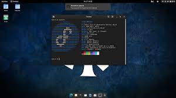
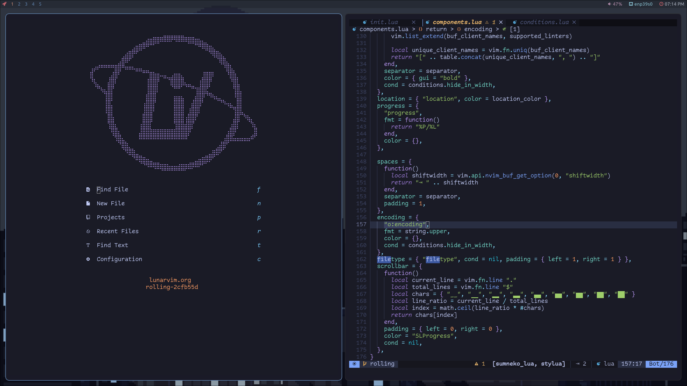
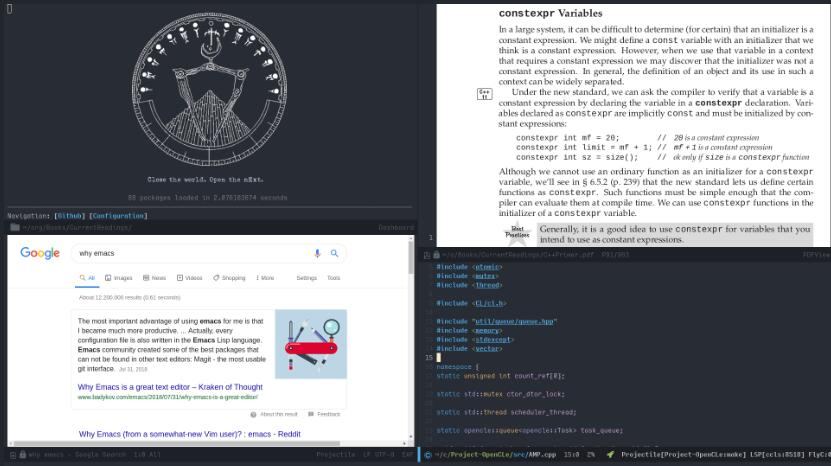
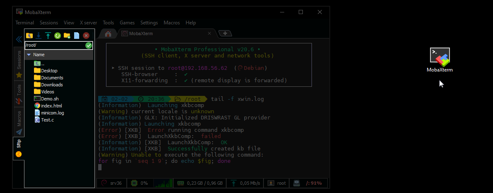
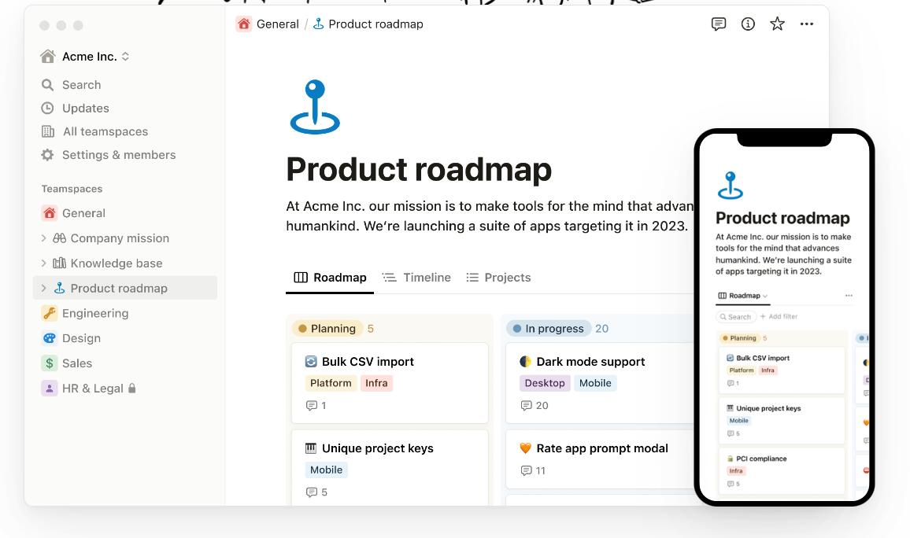
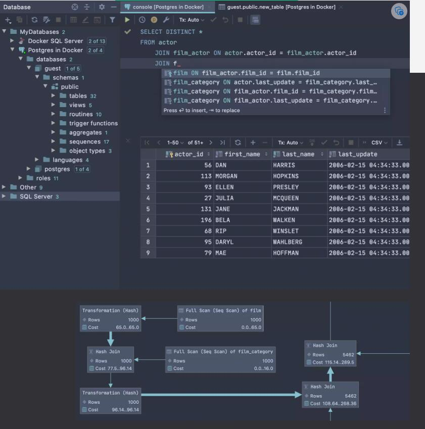

    

<h1 align="center">ToolSet</h1>

English | [简体中文](README_ZH.md)

🔧Toolset for personal use🔧

[📝Guide](https://github.com/theRunCom/ToolSet/wiki/Guide) |
[🔭Preview](#Preview) |
[☕Donation](#Donation)

## Preview

### **WSL2 Fedora37**

Fedora 37为开发人员提供了许多好处。它是一款可靠、用户友好且功能强大的操作系统，适用于笔记本电脑或台式电脑。它支持广泛的开发人员，从业余爱好者和学生到企业环境中的专业人士!

### **LunarVim**

### **Emacs**

### **Vscode**

### **Mobaxterm**

### **Notion**

### **Tmux**

### **IDEA**

### **DataGrip**

### **Visual Studio**

