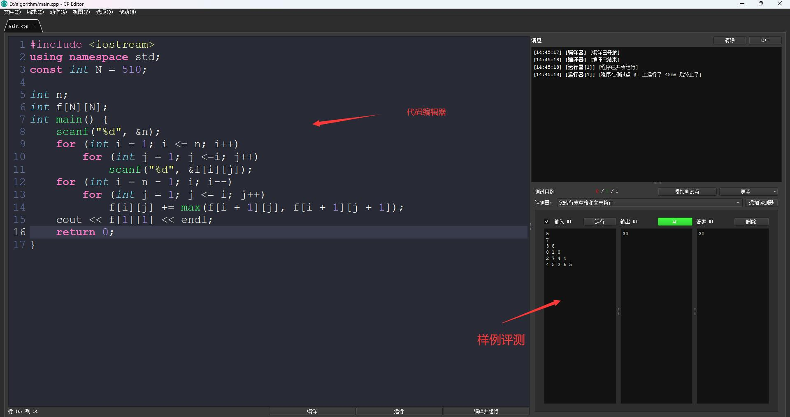

    

<h1 align="center">ToolSet</h1>

English | [简体中文](README_ZH.md)

🔧Toolset for personal use🔧

[📝Guide](https://github.com/theRunCom/ToolSet/wiki/Guide) |
[🔭Preview](#Preview) |
[☕Donation](#Donation)

## Preview

**LunarVim**

**DoomEmacs**

**Vscode**

**Mobaxterm**

**Notion**

**Tmux**

**IDEA**

**Lazygit**

**DataGrip**

**Visual Studio**

**CP Editor**

CP代表Competitive Programming，即竞技式编程。CP Editor 提供了各种有用的功能，如智能代码补全、自动代码评估、代码测试、交互式命令台等，以帮助用户更有效地练习算法竞赛。

